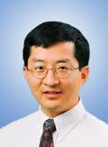

People
====================================================

Faculty
----------------------------------------------------------------------

* `Prof. Chunming Qiao, Department of Computer Science and Engineering, University at Buffalo <http://www.cse.buffalo.edu/~qiao/mysite/index.html`_
  |image-qiao|
* `Prof. Sanjukta Das Smith, Management Science and Systems Department, University at Buffalo <http://mgt.buffalo.edu/faculty/academic/systems/faculty/sdsmith4>`_ 
  |image-sdsmith4|
* `Prof. Ram Ramesh, Management Science and Systems Department, University at Buffalo <http://mgt.buffalo.edu/faculty/academic/systems/faculty/rramesh>`_
  |image-rramesh|
* Dr. Anna Ye Du, Texas A&M University, College Station
* `Prof. Tom Furlani, Director of CCR, University at Buffalo <http://www.buffalo.edu/ccr/people/staff/furlani.html>`_
  |image-TomFurlani|

* `Prof. Gregor von Laszewski, School of Informatics and Computing, Indiana University <http://gregor.cyberaide.org>`_
  |image-gregor|

Staff
----------------------------------------------------------------------

* Fugang Wang, Indiana University

Students
----------------------------------------------------------------------

* Hyungro Lee, Indiana University
* Zhouhan Yang, Doctoral Student at University at Buffalo - Computer Science and Engineering, School of Engineering and Applied Sciences
* Shuai Yuan, Doctoral Student at University at Buffalo - Management Science and Systems, School of Management
* Vinoth Selvaraju, Master Student at University at Buffalo - Computer Science and Engineering, School of Engineering and Applied Sciences

.. |image-TomFurlani| image:: images/TomFurlani.jpg
.. |image-rramesh| image:: images/rramesh.jpg
.. |image-sdsmith4| image:: images/sdsmith4.jpg
.. |image-gregor| image:: images/gregor.jpg