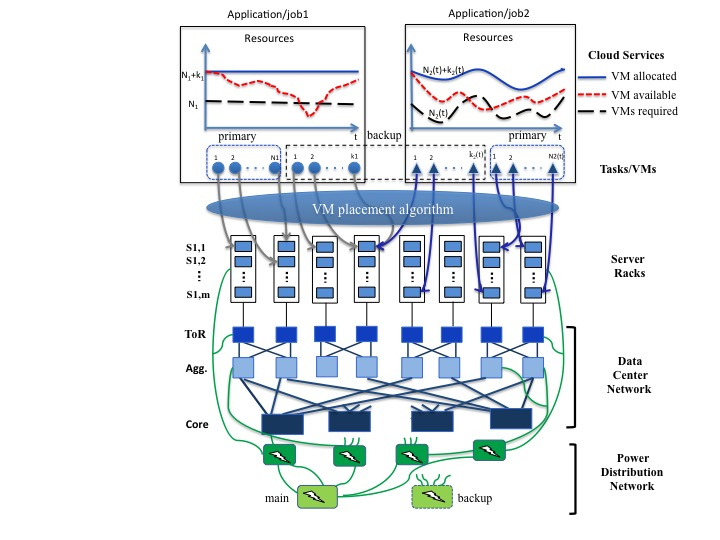

Overview
======================================================================

**Collaborative Research: An Analytic Approach to Quantifying Availability (AQUA) for Cloud Resource Provisioning and Allocation**

Motivation
----------------------------------------------------------------------

Cloud computing will significantly transform the landscape of the IT
industry and also impact the economy and society in many ways. The
availability of cloud services, affected by various failures including
inaccessibility of cloud resources, becomes increasingly more
critical, as government agencies, business and people are expected to
rely more and more on these services. According to a 2011 report [1],
on average, a service outage lasts about 134 minutes, and these
service outages cost about $426 billion of loss worldwide.
Additionally, 2012 global survey found that availability/reliability
of cloud applications was cited by 67% of those surveyed as one of the
top challenges for preventing a successful implementation of cloud
services, followed by device based security (66%) and cloud
application performance (60%).

In order to cost-effectively provide a desired level of availability
(e.g., 99%) for an application requiring say N VMs, an
Infrastructure-as-a-Service (IaaS) provider needs a middleware to
determine the minimum number of backup VMs, say K, to be provisioned,
and in addition, how these (N+K) are placed (or mapped) to the
servers, as well as other servers and VM management strategies (e.g.,
when to power- on servers with the backup VMs etc.). In turn, the
middleware needs an efficient model to predict the availability that
can be achieved for a given N, K and other system settings. In
particular, the middleware will need a comprehensive knowledge of the
failure characteristics of the physical components such as servers and
switches including their mean-time-between-failure (MTBF) and
mean-time-to-repair (or replacement) (MTTR) and in particular, how the
failures may be correlated temporally and spatially. Despite a body of
recent work on reporting/characterizing failures in datacenters, there
still lacks a comprehensive and publicly accessible failure data set
for use by researchers in academia/universities. In addition, although
there exist some heuristics to qualitatively improve availability
using e.g., triple duplication, and methods to measure the
availability in a post-priori fashion, to the best of our knowledge,
there exists no quantitative tools, including analytic models, to
accurately predict the availability, let alone any methods to
determine the optimal VM provisioning and allocation (placement) to
achieve a given availability level.

It is worth noting that the proposed project is inspired and built
upon a recently research project sponsored by Google (Disaster
Recovery and Availability Prediction (DRAP) for Clouds, $102,000,
1/1/2012 to 12/31/2012) carried out by the PIs. Google's interest in
achieving a (minimum) availability level for certain cloud services /
applications arises from the fact these cloud services require a
quorum provided by at least N running VMs. Google researchers who
sponsored the project have not only guided our project but also
provided several useful insights including the need to consider
correlated (or cascaded) failures of servers and switches/routers (one
must realize that Google can't provide any detailed physical component
failure data or application performance requirements to academia
researchers). Their suggested future work has helped shaped the scope
and approaches described in this proposal.

Approach
----------------------------------------------------------------------

This project will take a holistic approach to meeting a required availability level for a given cloud application or (service) by

* Collecting and analyzing a large set of log data about physical
   components (such as servers and switches) from large-scale
   production systems, and model their failure processes
* Designing novel availability-aware middleware (mainly algorithms)
  for provisioning and allocation of both working and backup VMs for a
  given cloud application requiring a certain availability level (e.g., 99%)
* Using effective models and analytic techniques, e.g., sample path
  analysis, to predict the availability to be achieved given the
  information on the provisioned and allocated resources; the
  predicted availability is then used to determine e.g., the number of
  additional backup VMs needed, and how the working and backup VMs are
  to be placed in a datacenter so as to achieve the
  desired availability level
* Implementing the proposed middleware, and running cloud applications
  in our cloud testbed to validate and evaluate the proposed
  availability-prediction models and availability-aware
  resource provisioning and allocation algorithms.

|image-holistic|  

Fig. 1 illustrates the overall system model to be considered in this project. As shown, we will consider two types of applications/jobs

The first (e.g., Application/Job 1) is relatively critical in that it
requires a (constant) minimum number of VMs, e.g., N1, be available
most of the time (e.g. 99.9%) The second (e.g., Application/Job2) can
afford a dynamic (i.e., time-varying) number of VMs, e.g., N2(t) at
time t, with a lower availability In either case, multiple backup VMs
(e.g., K1 > 1) may be needed to meet the availability requirement of a
given application/job. This is due to the fact that when a virtualized
server fails, multiple VMs placed on the server will all fail. It is
also worth noting that even at the server levels, failures (or
non-accessibility) may be correlated both temporally and spatially.

