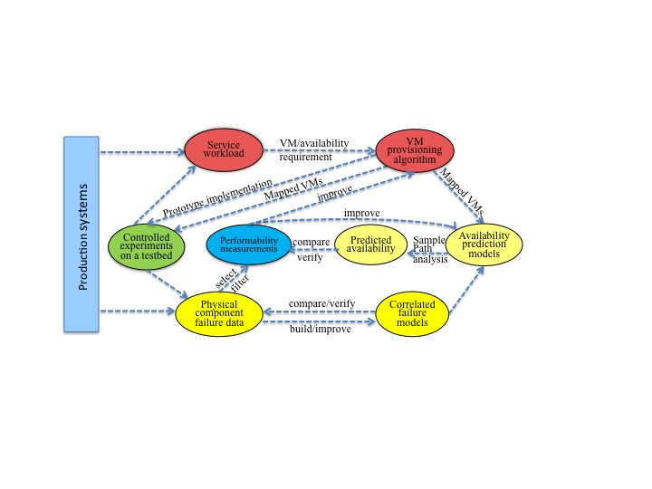

Research Thrusts
======================================================================

Research Thrusts
----------------------------------------------------------------------

-  Thrust1 - Application-layer and middleware related issues

   -  Service characterization through detailed VM-level instrumentation
      and process-level measurements on CPU, memory, I/O and network
      usage
   -  VM allocation and placement algorithms

-  Thrust2 - Availability prediction models and solution techniques
-  Thrust3 - Lower layer issues

   -  Collection and analysis of (temporally and spatially correlated)
      failure data on physical components of the UB-CCR and IU-FG-Cloud
   -  Failure modeling

-  Thrust4 - Conducting controlled experiments on UB-CCR and IU-FG-Cloud

|image2|

Novelty and Intellectual Merits
----------------------------------------------------------------------

The proposed research has the following novelties and intellectual
merits,

-  Rigorous quantification and prediction of availability for a finite
   duration:
-  Availability-aware multi-objective optimization
-  Experiments on production and testbed systems

Expected Broader Impact and Contributions
----------------------------------------------------------------------

-  Significant advancement of the state-of-the-art by offering deep
   insights into factors affecting the availability in cloud computing,
   and producing and disseminating useful data sets, analytic models and
   computational tools, as well as cost-effective resource provisioning
   and allocation methods (middleware and algorithms) that will be
   useful to achieve a high availability level.
-  Development of new tools to collect, and also an integrated secure
   web interface to provide public access to

   -  Large set of fine-grained failure data on physical components such
      as the servers and switches/routers and another large set of data,
   -  Large set of data on services' workload characteristics and
      performance/usage (e.g., CPU, memory, I/O, Network) at the VM
      Manager (VMM) level

-  Fast and accurate estimation of the availability, can also be a
   useful tool to solve other complex models in other disciplines
-  Improvement on Service Level Agreement (SLA) guarantee on service
   availability
-  Stimulate and enable marketing and economic research on constructing
   service level agreement (SLA) with a reasonable price and
   availability guarantee etc.
-  Improvement of the availability/reliability of cloud services, and
   thus benefit the existing users and applications, reduce millions of
   dollars of losses in revenue and productivity due to service outages,
   and avoid wasted energy consumed by interrupted jobs. Importantly, it
   can also encourage new users and applications, generating further
   cost savings and increased productivity to customers and increased
   revenues to service providers, which in turn positively impact our
   economy.

